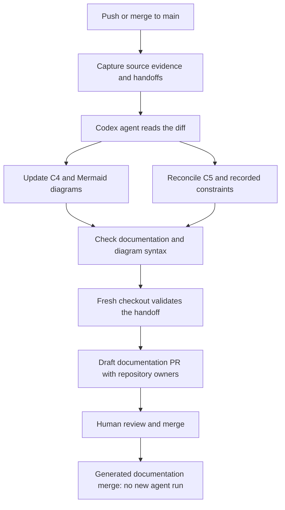

# Main-push documentation agent

Every push to main starts .github/workflows/c5-documentation.yml. A relevant
change launches a new Codex agent on a GitHub runner. The agent reads the
merged diff, relevant source, captured handoffs and existing documentation,
updates C4 views and Mermaid diagrams, and reconciles C5 change provenance.
It does not resume an existing Codex cloud chat.



## Activation

Merge this workflow into main, enable Actions, and configure the GitHub
Actions secret **CODEX_DOCS_API_KEY** with an OpenAI API key. Enter it securely
in GitHub Settings > Secrets and variables > Actions, never in a PR or chat.
An organization secret may be restricted to the intended repositories.
The JaipuriaAI and JaipuriaAILabs organizations have separate secret settings.

The official [Codex Action](https://github.com/openai/codex-action) requires
model authentication. API usage is billed to the API project; this chat's
login or ChatGPT subscription is not passed to a GitHub runner. Use an API
project with an appropriate spending budget. The workflow requires no
Supabase, Portkey, Moodle or other application keys.

Settings > Actions > General must allow GitHub Actions to create pull
requests. The setting is named **Allow GitHub Actions to create and approve
pull requests**, but this workflow never approves or merges. The current
cloud integration cannot inspect or administer that setting or Actions
secrets: GitHub returns HTTP 403. Its state is not independently confirmed.

After configuration, use Actions > C4 and C5 documentation > Run workflow on
main for a catch-up run. A successfully completed agent job and publishing job
establish activation. PR validation alone does not establish a live model run.

## Execution and evidence

The existing compiler first records exact commit/path metadata and captured
handoff links in an immutable source snapshot. It flags source drift while
preparing the task. Its snapshot describes that preparation step, which uses
no model. A later, distinct agent execution record describes the agent work.

The official Codex Action and artifact actions are pinned to reviewed commits;
Codex CLI and its Responses API proxy are pinned to the workflow's version.
The CLI chooses its default model. Exact model identity remains unknown unless
independently captured; a configured CLI version is not a model attribution.

The agent reconciles affected views, README's visual system map, selected
constraints and C5. It may add sanitized source observations and proposed or
observed decisions. It preserves accepted decisions and historical raw inputs.
Unresolved views retain Outdated or Disputed status and explicit gaps.

C5 separates this documentation agent's work from the original coding work.
Commit authors do not prove original agent identity, human approval, rationale
or completed checks. Missing context remains unknown.

## Validation and publishing

The agent job has read-only GitHub permissions. A separate job with no model
secret checks out the same source revision and imports a bounded JSON handoff.
Only the permitted Markdown views, README, index, append-only history, state
and new evidence/decision records can enter the update. Paths escaping the
checkout, symlinks, application edits, old raw rewrites, changed history and a
wrong repository/revision/run identity block publication.

The documentation checker and a pinned Mermaid parser run after the agent and
again in the fresh publishing checkout. The parser validates syntax, not the
meaning of a diagram. Human review remains necessary for architecture claims.
Application tests, devices, live services and deployment are unrun by this
workflow. Super-outer's package-digest declaration is the only runtime-file
exception; its existing helper verifies that no behavior changed.

Draft PRs target main and use this repository's configured owners/reviewers.
The publisher never marks ready, force-pushes, merges or deletes a branch.
It invokes no paid Greptile reviewer. GitHub-token-created PRs do not trigger
other PR workflows, so this pipeline validates its own output before publishing.

## Catch-up, retries and cost

Comparison starts from the last merged documentation baseline. Source updates
while a draft is pending therefore remain in the next reconciled range.
Review older drafts before merging a newer update.

Generated views, agent evidence and automation decision records are excluded
from relevant inputs. Their merge starts the workflow but launches no additional
agent and creates no recursive PR. New human/coding-agent handoffs remain inputs.
There is no cron or separate Codex cloud scheduler.

An existing PR for the source revision is preserved without another model run.
A branch without a PR indicates partial publication and blocks a paid retry
until inspected. Failed PR/branch lookups fail closed. Missing model
authentication fails explicitly; there is no silent compiler-only fallback.
Force-pushing main past the baseline requires deliberate reconciliation.

## Local checks

Install only the isolated documentation parser dependencies, then run the
helper tests, source/evidence checker and Mermaid parser:

```bash
npm install --prefix /tmp/c5-mermaid --no-save --package-lock=false mermaid@11.12.0 jsdom@26.1.0
C5_MERMAID_MODULES=/tmp/c5-mermaid/node_modules python -m unittest discover -s scripts/c5-documentation -p 'test_*.py'
python docs/architecture/check_docs.py
node scripts/c5-documentation/check_mermaid.mjs /tmp/c5-mermaid/node_modules
```

The agent handoff tests use simulated model edits and real Git histories,
fresh clones, documentation checks and diagram parsing. They do not call a
model or prove API authentication. A real authenticated main/manual run remains
necessary before declaring the unattended agent active.
