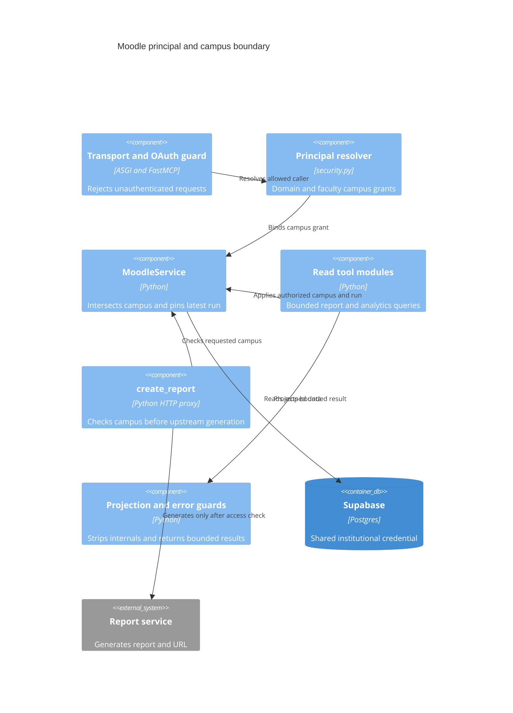

# Jaipuria Moodle Reports MCP: c4-components-campus

> Raw: [baseline evidence](../raw/2026-10-01-baseline.md)
> Fingerprint: git:997f8797d9731df94ca083fb285155d7c21a7eb5
> Monitored: server.py, security.py, supabase_client.py, tools, guardrails.py, annotations.py, oauth_compat.py, config.py, cache.py, requirements.txt, render.yaml, Dockerfile, Procfile
> Status: Current

A missing grant and an all-campus grant are different states; operator defaults must be reviewed explicitly. Resolving a run ID without first checking its campus can bypass downstream scope assumptions. The generation action must keep its campus gate and non-read-only annotation, despite sharing read-only query helpers ([evidence](../raw/2026-10-01-baseline.md)).

Read [security.py](../../../security.py), [supabase_client.py](../../../supabase_client.py), [actions.py](../../../tools/actions.py), and [oauth_compat.py](../../../oauth_compat.py).
