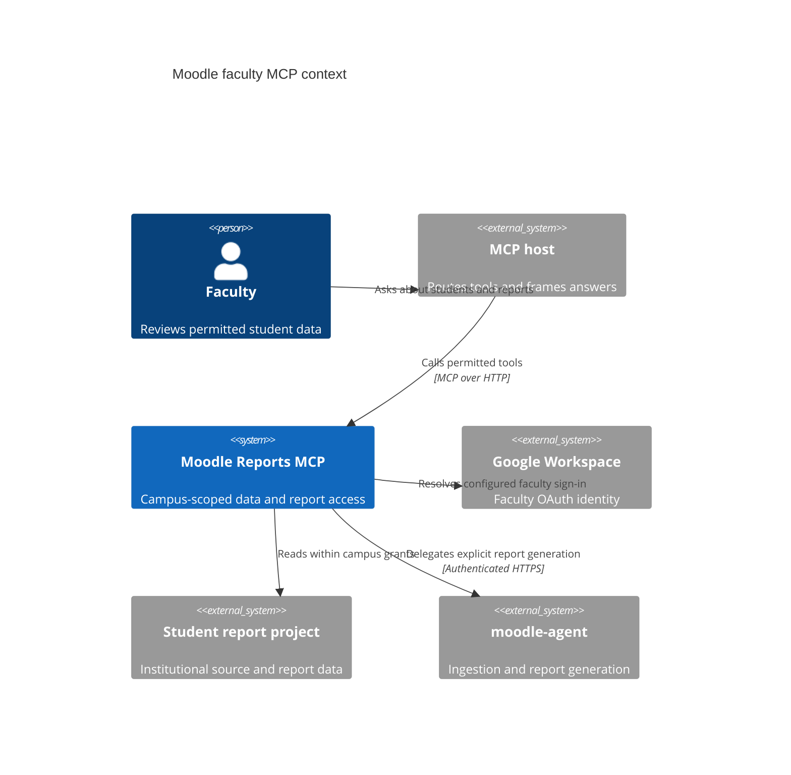

# Jaipuria Moodle Reports MCP: c4-context

> Raw: [baseline evidence](../raw/2026-10-01-baseline.md)
> Fingerprint: git:997f8797d9731df94ca083fb285155d7c21a7eb5
> Monitored: server.py, security.py, supabase_client.py, tools, guardrails.py, annotations.py, oauth_compat.py, config.py, cache.py, requirements.txt, render.yaml, Dockerfile, Procfile
> Status: Current

This faculty boundary differs from the learner-per-user RLS model in Rehearsal MCP. Report generation is a deliberate side effect in an upstream service, even though the MCP itself does not write report tables ([evidence](../raw/2026-10-01-baseline.md)).
